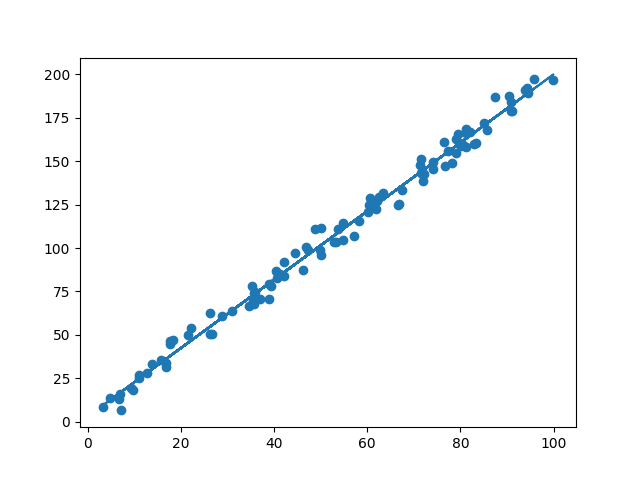
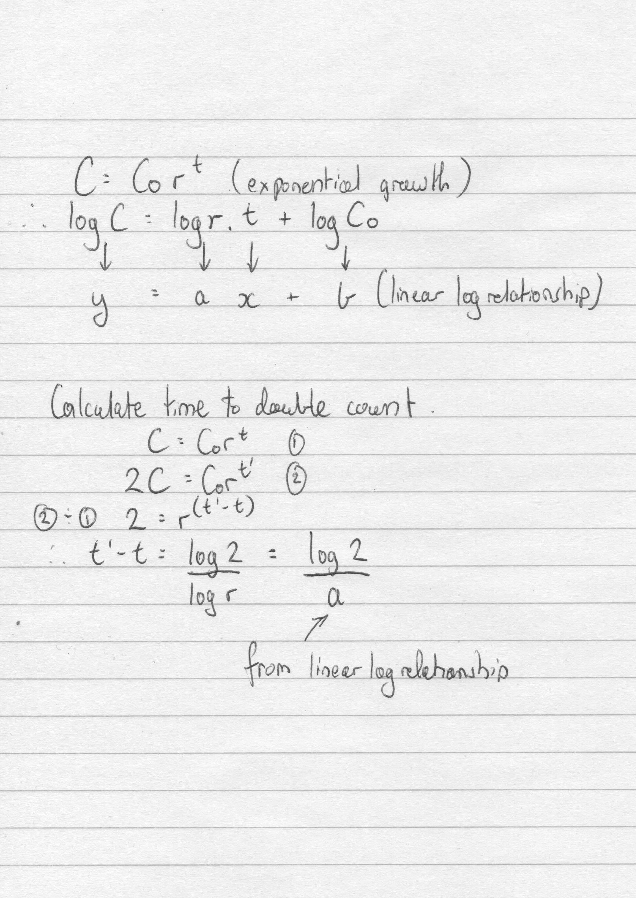

Python -  Numpy, MatPlotLib
# Simple Linear Regression
Calculating line of best fit from 1-D dummy Data
- See LinearReg.py
- Import dummy x/y data points in CSV file and convert to Numpy arrays
- Calculation of yhat using Numpy. y=ax+b:
- 
- Scatter plot of dummy data using matplotlib.
- Line plot of yhat using matplotlib.
- 
- calculate and print r-squared 
- 

# Simple linear regression for exponential relationships

Testing whether Moore's Law is true - that the number of transistors on an integrated circuit doubles every 2 years.

- See MooresLaw.py
- Since relationship is exponential we use log(Y) to calculate a linear relationship (yhat) and derive the time to double the transistor count based on the gradient of the line of best fit:
- 

Results
